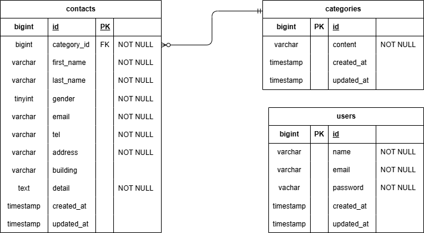

# お問い合わせフォーム

Dokerビルド

・git clone git@github.com:mako236630/contact-laravel.git 
・docker-compose up -d --build
 
 
 
laravel環境構築 
・docker-compose exec php bash 
・composer install 
・cp .env.example .env 環境変数を適宜変更 
・php artisan key:generate 
・php artisan migrate 
・php artisan migrate:fresh --seed
 
 
 
開発環境 
・お問い合わせ画面　http://localhost/ 
・ユーザー登録　http://localhost/register 
・phpMyadomin http://localhost:8080/
 
 
 
テスト用ログイン情報 
・php artisan db:seed 
・メールアドレス：test@example.com 
・パスワード：password123
 
 
 
使用技術 
・PHP 8.1.33 
・Laravel 8.83.8 
・MySQL 8.0.26 
・nginx 1.21.1
 
 
 
ER図

